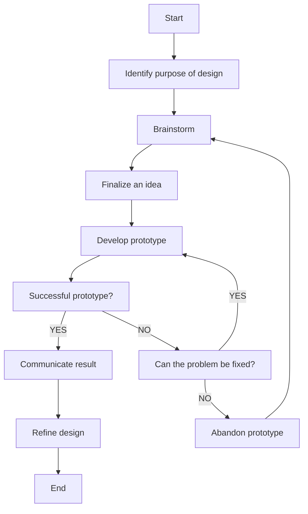

### Hi there 👋

- 🕹️ I’m interested in computer graphics and virtual reality development, especially at the intersection with human perception research
- 🔭 Currently learning about optimization techniques for deploying multimodal models on mobile devices
- 🖥️ Meta and AMD shareholder
- 📚 My work bridges technical implementation with real-world understanding of how humans see, think, and interact in immersive environments
- 💬 I enjoy learning new languages: 🇰🇷🇺🇸🇯🇵🇨🇳💻
- [Poorly written blog of mine](https://hyeondg.org)

#### [Full CV (Overleaf)](https://www.overleaf.com/read/dthdchqkzjht#efd09d)
